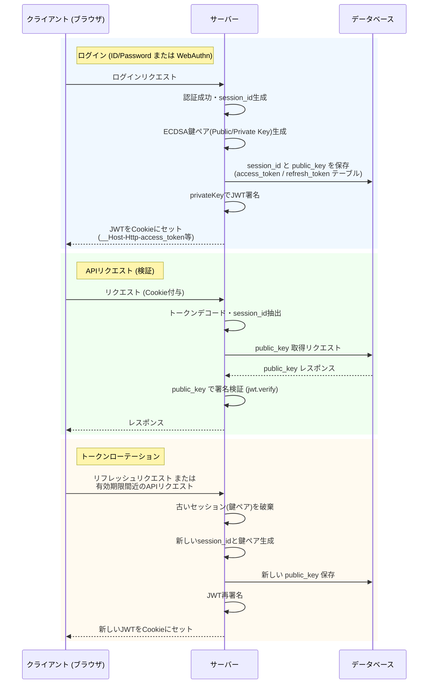
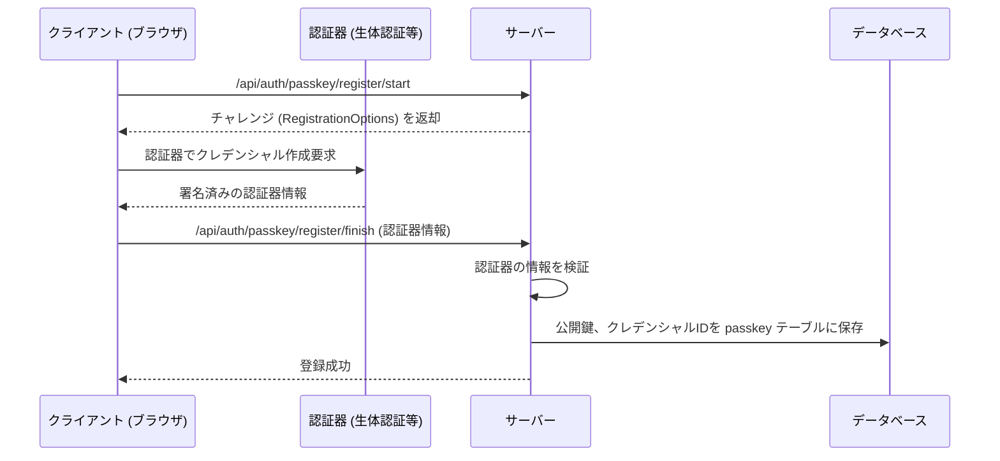
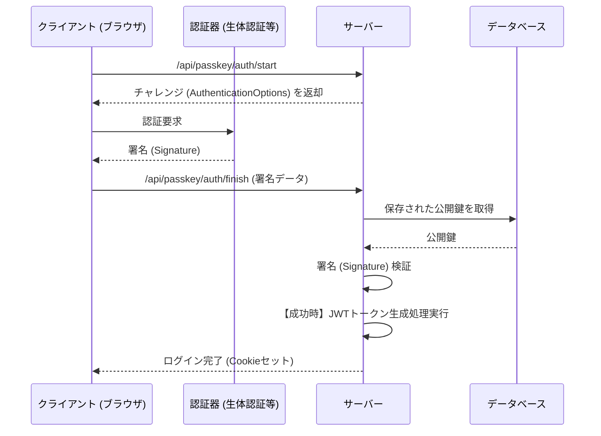

# 認証仕様 (Authentication Specification)

## 概要

本アプリケーションの認証システムは、従来のID・パスワードによる認証に加え、生体認証などを利用可能な**パスキー (WebAuthn)** をサポートしています。セッション管理には非対称鍵（ECDSA）を用いたステートフルな **JSON Web Token (JWT)** を採用し、セキュアなHttpOnly Cookieを介して通信を行います。

## データ構造とハッシュアルゴリズム

### 1. ユーザー識別とパスワード

データベースには生のIDやパスワードは保存されません。

- **ログインID (`id`)**: 漏洩リスクを考慮し、SHA-256 (`sha256Gen`) によりハッシュ化されて保存されます。
- **パスワード (`password`)**: パスワードクラッキング耐性の高い **Argon2** (`argon2Gen` / `argon2Verify`) を用いてハッシュ化されます。

### 2. フィンガープリントによる多重登録防止

- 本番環境 (`NODE_ENV === 'production'`) では、クライアントから送信されるブラウザフィンガープリント (`x-fp-hash` ヘッダー) にサーバー側ペッパー (`META_DATA.FP_PEPPER`) を付与してハッシュ化し、`auth` テーブルの `fp_hash` として保存します。
- これにより、同一デバイスからの無制限な新規アカウント作成（初期パラメーターリセマラや多重登録）を防止します。

### 3. 登録ユーザー数の上限制御

- 環境変数 `MAX_REGISTERED_USERS` で、登録可能な有効ユーザー数（`user.inhabited = 1`）の上限を設定できます。
- サインアップ時に上限へ到達している場合は、新規登録を拒否します。

## セッション管理とJWT

アクセストークンおよびリフレッシュトークンを併用し、データベースと連携したセッション管理を行います。

### 1. トークンの仕様

- **アクセストークン**:
  - Cookie名: `__Host-Http-access_token`
  - 署名アルゴリズム: **ES256** (ECDSA P-256)
  - 有効期限: `META_DATA.ACCESS_TOKEN_EXPIRES_HOUR`
- **リフレッシュトークン**:
  - Cookie名: `__Host-Http-refresh_token`
  - 署名アルゴリズム: **ES384** (ECDSA P-384)
  - 有効期限: `META_DATA.REFRESH_TOKEN_EXPIRES_HOUR`

どちらも `HttpOnly`, `Secure`, `SameSite: 'strict'` として設定されるため、JavaScriptからのアクセス（XSS攻撃でのトークン窃取）が不可能になっています。また、`__Host-` プレフィックスを使用することでブラウザによるCookieの書き換えを防ぐ高いセキュリティレベルを維持しています。

### 2. トークン生成・検証のフロー (`src/global/function/auth.ts`)

1. **ログイン時**:
   - 新しい `session_id` と非対称鍵ペア (Public/Private Key) が生成されます。
   - `public_key` を `access_token` および `refresh_token` テーブルへ保存します。
   - 秘密鍵 (`privateKey`) で `session_id` と対象のユーザーUUIDをPayloadとしたJWTを署名し、Cookieにセットします。
2. **検証時**:
   - リクエストのCookieからトークンを取得し、デコードして `session_id` を抽出します。
   - データベースの `access_token` (または `refresh_token`) テーブルから、該当セッションの `public_key` を取得します。
   - この `public_key` を用いて、トークンが改ざんされていないか電子署名の検証 (`jwt.verify`) を行います。
3. **ローテーション**:
   - リフレッシュトークンによる再認証が行われたり、トークンの有効期限が近くなった（80%経過した）場合は、古いセッションを破棄し、新しい鍵ペアと `session_id` によるトークンを再発行する**トークンローテーション**の仕組みを備えています。

#### JWTセッション管理フロー図

## パスキー (WebAuthn) 認証フロー

`@simplewebauthn/server` および `@simplewebauthn/browser` ライブラリを利用してパスキーによるパスワードレス認証を実現しています。

- **登録フロー**:
  1. `/api/auth/passkey/register/start`: 登録用のチャレンジ（RegistrationOptions）を生成します。
  2. `/api/auth/passkey/register/finish`: クライアントで生成した認証器の情報を検証し、`passkey` テーブルに公開鍵やクレデンシャルIDを保存します。
- **認証フロー**:
  1. `/api/passkey/auth/start`: 認証用のチャレンジ（AuthenticationOptions）を生成します。
  2. `/api/passkey/auth/finish`: クライアント側のSignature検証を行い、成功すれば上記のJWTトークン生成処理を呼び出してログインを完了させます。

#### パスキー登録フロー図

#### パスキー認証フロー図

## アカウントロックアウト機能

ブルートフォース（総当たり攻撃）に対抗するため、`auth` テーブルの `login_fail_count` および `locked_until` カラムを利用したアカウントロック機能が実装されています。

- ログインに失敗するたびに `login_fail_count` が加算されます。
- 一定回数 (`META_DATA.LOGIN_FAIL_LIMIT`) 連続して失敗すると、アカウントが指定時間 (`META_DATA.LOGIN_LOCK_MINUTE`) ロックアウトされ、一時的に認証を拒否します。
- 正しいパスワードが入力されるか、ロック解除時間を経過した後に再ログインした場合はカウントがリセットされます。
