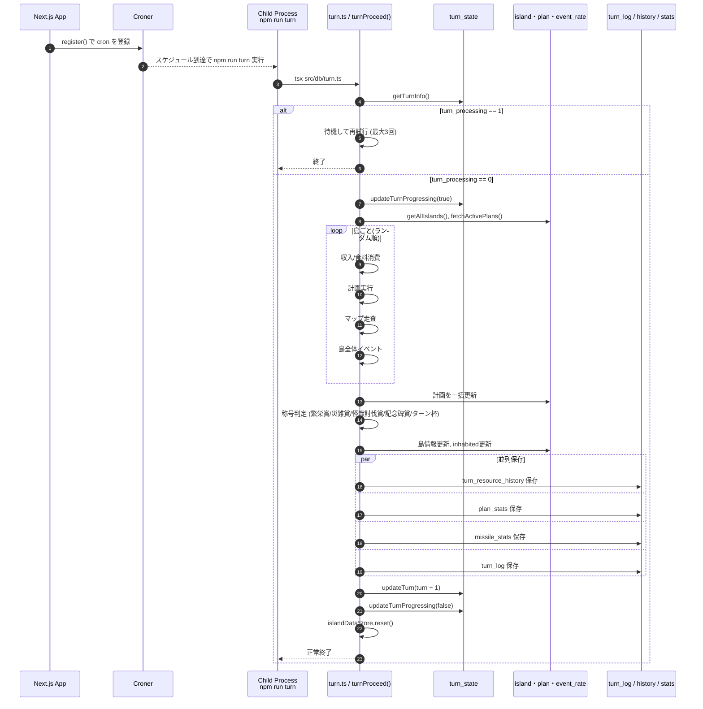

# ターン処理仕様 (Turn Process Specification)

## 概要

このドキュメントは、ターン進行の実行順序と各フェーズの責務を整理したものです。
実装上の主なエントリは以下です。

- 自動実行トリガー: `src/instrumentation.ts` (cron -> `npm run turn`)
- ターン本体: `src/db/turn.ts`

## 実行トリガー

1. Next.js 起動時に `register()` が実行される。
2. `NEXT_PUBLIC_TURN_CRON` と `NEXT_PUBLIC_TURN_TIMEZONE` を使って Cron を登録する。
3. スケジュール時刻になると子プロセスで `npm run turn` を実行する。
4. `npm run turn` は `tsx ./src/db/turn.ts` を起動する。

## ターン処理の全体順序

`turnProceed()` は以下の順序で進行します。

1. `turn_state` を取得する。
2. `turn_processing` が `1` の場合は待機して再試行する（最大3回）。
3. `turn_processing` を `1` に更新して排他開始。
4. 全島データを取得し、メモリストアに展開する。
5. 島ごとにターン処理を実行する（実行順はランダム）。
6. 称号付与（繁栄賞、災難賞、怪獣討伐賞、記念碑賞、ターン杯）を判定する。
7. 島データを保存し、滅亡島の居住状態を更新する。
8. 以下を並列で保存する。
   - 資源履歴 (`turn_resource_history`)
   - 計画統計 (`plan_stats`)
   - ミサイル統計 (`missile_stats`)
   - ターンログ (`turn_log`)
9. `turn_state.turn` を `+1` し、`last_updated_at` を更新する。
10. `finally` で `turn_processing` を `0` に戻し、メモリストアをリセットする。

## 島ごとの処理順序

各島に対して、次のフェーズをこの順に実行します。

1. 収入/食料消費フェーズ
   - 農場・工場・採掘場に応じて食料/資金を増減
   - 人口に応じた食料消費を適用
2. 計画実行フェーズ
   - `plan_no` 順に計画を実行
   - 実行結果ログを収集
   - 完了/失敗計画を整理し、後で一括書き込み
3. マップ走査フェーズ
   - 全マスを走査し、地形イベントを実行
   - 面積/人口/施設数などの統計値を再計算
   - 食料上限超過の資金化、資金の上下限補正
4. 島全体イベントフェーズ
   - 地震、食料不足、津波、怪獣、地盤沈下、台風、巨大隕石などを順番に判定

島ループ終了後に、計画更新を1トランザクションで一括反映します。

## 再実行制御

- `turn_processing = 1` の間に重複実行が来た場合、待機して再試行します。
- 待機時間は `WAIT_TIME * 試行回数`（実装値は 2000ms 基準）です。
- 最大試行回数を超えた場合はエラーログを出して終了します。

## シーケンス図

## 補足

- 称号付与は `updateIslands` より先に実行され、当該ターンの島状態に反映されます。
- 資源履歴は同一ターン再実行時の重複を避けるため、対象ターンを先に削除してから挿入します。
- 資源履歴は各島ごとに最新100件を保持し、それより古い履歴を削除します（100件目のターンを閾値にクリーンアップ）。
- 公開/秘密ログは `turn_log` に保存され、表示時は既存のログタグ変換仕様に従って描画されます。
