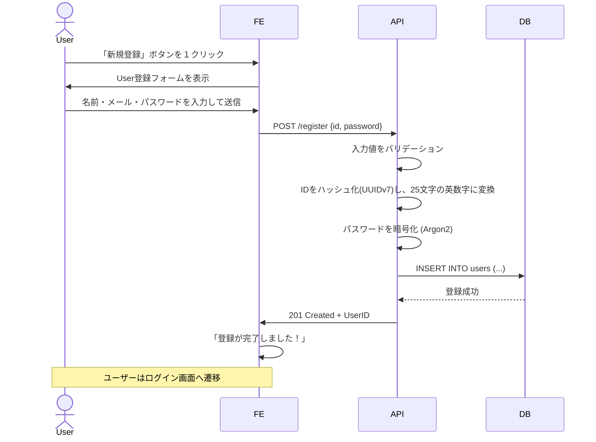

# ユーザー登録機能 (例)

## 📝概要

- ユーザーがメールアドレスとパスワードを入力してアカウントを作成できる機能

## 😎想定ユーザー

- 一般ユーザー（未ログイン状態）
  - クレジットカードなどの特別な情報は扱わない

## 🕑使用タイミング

- サービス初回利用時、または再登録時

## 🏢設計箇所

- Webアプリの `/signup` ページ

## 🤔必要性

- サービス利用者の識別と個別データ管理のため

## 🎨詳細設計

### シーケンス

### 詳細

#### ID

ハッシュ化はUUIDv7を使用。URLなどに用いるため、25文字の英数字に可逆圧縮した。

#### パスワード

パスワードは堅牢なArgon2を使用。実行回数は一般的な3回にした。
